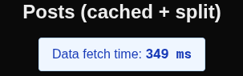
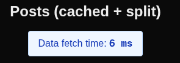

# Frontend Exercise

A Next.js demo that fetches posts from a public API, caches them in Redis, and applies code-splitting for performance.

---

## Architecture

- **Next.js** (App Router) renders `/posts` server-side.
- **Redis** (cache-aside) speeds up repeat fetches with a 60 s TTL.
- **PostList** is a Client Component, loaded dynamically to keep the initial JS bundle small.

## Quick Start


Go inside the folder Demo-App

```bash
cd Demo-App
```

### Automated (recommended)
Ensure `setup.sh` is executable:
```bash
chmod +x setup.sh
```
Then run
```bash
./setup.sh
```

This will check for the following :

- The required tools (git, node, npm, docker, docker-compose).
- It will create the '.env.local' file if not already created with 'REDIS_URL=redis://localhost:6379'
- It will start the Redis via Docker.
- Will install the Dependencies.
- Will ask you if you want to build and start the app.

### Manual

If you prefer setuping manually you can follow the next steps :

1- Clone and Install
```bash
git clone <the-repo-ssh>
```

```bash
npm install
```

2- Start Redis

```bash
docker-compose up -d
```

3- Build and Start

Dev: --> http://localhost:3000
```bash
npm run dev
```
Prod:
```bash
npm run build && npm start
```
<br></br>

## Environment, Docker

- **Docker**:  
  Contains a Redis container, can be started via `docker-compose up -d`.  

- **Environment Variable**:  
  The app uses a single env variable:  
  `REDIS_URL=redis://localhost:6379` — automatically created by `setup.sh`.

The REDIS_URL environment variable tells the app where to connect to Redis.
`redis://localhost:6379` which means:

- protocol: redis://

- host: localhost

- port: 6379 (the default Redis port)

So the app can talk to the local Redis container running via Docker.

## Pages Overview: Posts (SSR) and Users (CSR)

This demo includes two pages to demonstrate both **Server-Side Rendering (SSR)** and **Client-Side Rendering (CSR)**:

### **Posts Page (/posts)**
- **Rendering Type**: **Server-Side Rendering (SSR)**.
- **Why SSR?**
  - The posts page fetches data on the server before rendering the page. This ensures that the data is available when the page is sent to the client, improving SEO and reducing the time to first meaningful paint.
  - Redis is used to cache the data server-side, reducing API calls and improving performance for repeat visits.

### **Users Page (/users)**
- **Rendering Type**: **Client-Side Rendering (CSR)**.
- **Why CSR?**
  - The users page fetches data dynamically on the client after the initial page load. This approach demonstrates how to handle data fetching in a client component.
  - A custom API (`/api/users`) is used to fetch data from Redis or the external API, showcasing how server-side caching can still benefit CSR.
  - A loading state (`Loading users...`) is displayed while the data is being fetched, ensuring a smooth user experience.

By implementing both SSR and CSR, this demo highlights the flexibility of Next.js and how different rendering strategies can be used based on the requirements of the application.

## Performance

### **Redis Fetch Times**

#### **when you first visit : http://localhost:3000/posts or http://localhost:3000/users**

***Cache MISS*** shows the very first request where your app has to reach out over the network.

- in terminal:

 

- on the web page:




#### **reloading**

***Cache HIT*** shows repeat requests served in-memory by Redis—no network delay.

- in terminal:


- on the web page:

 


### **Dynamic Loading:**  
  The post list UI (`PostList`) is extracted into its own client component and dynamically imported only when needed.  
  
  
  **Why?**
   
   To Keep the initial JavaScript bundle smaller, so the page loads faster for first‐time visitors.

   The gain is minimal in this small demo, but it becomes significant in larger applications with heavier UI.


## Scaling Outline

#### To handle thousands or millions of users, i can think of the following:

- **Horizontal Scaling** which means Running multiple copies of the Next.js app behind a load balancer so traffic is spread across servers.

- **Managed Redis with TTLs** Moving to a hosted Redis service (e.g. AWS ElastiCache) and keep using short TTLs (time-to-live) so cached data stays fresh but Redis can serve huge read volumes.

- **CDN for Static Assets** Serving JavaScript, CSS and images via a Content Delivery Network so users worldwide download assets from the nearest edge location, cutting latency.

 **Future Consideration**  
  If the app needs to scale further or handle a large number of client-side requests, reintroducing an API route (e.g., `/api/users`) could be beneficial. 
  - **Why?**  
    - Centralizes request handling, making it easier to monitor, log, and secure client requests.
    - Allows the API to scale independently of the client-side logic.
    - Provides a standard interface for other parts of the app or external systems to consume data.